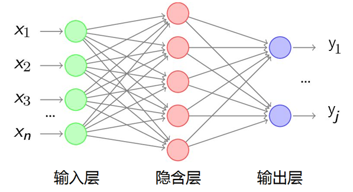
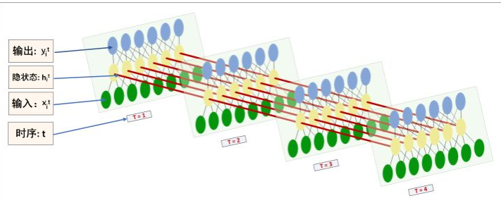
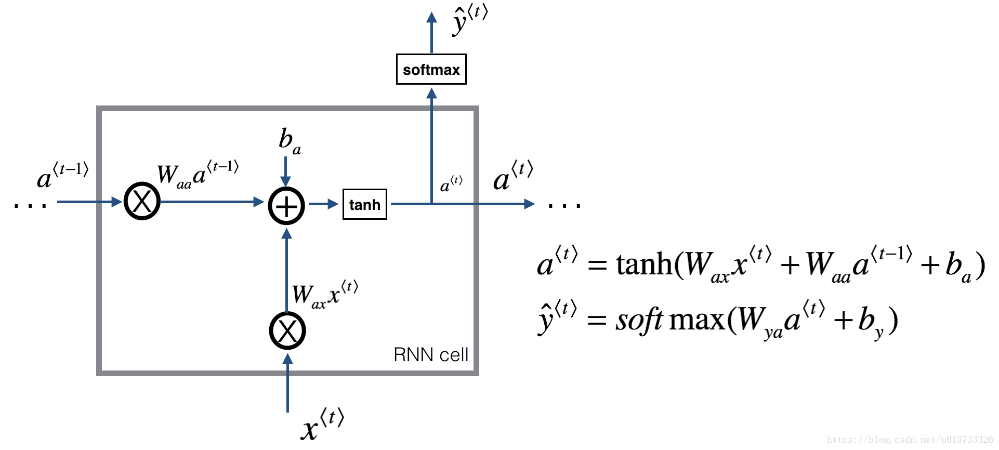
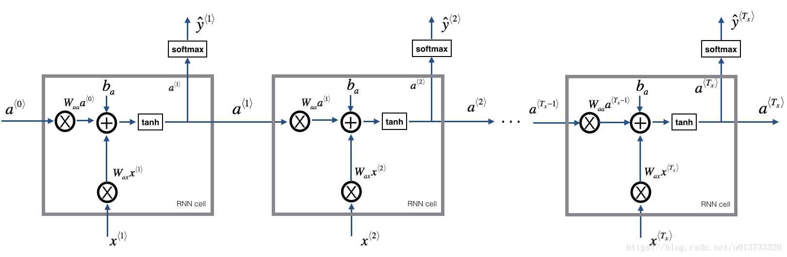
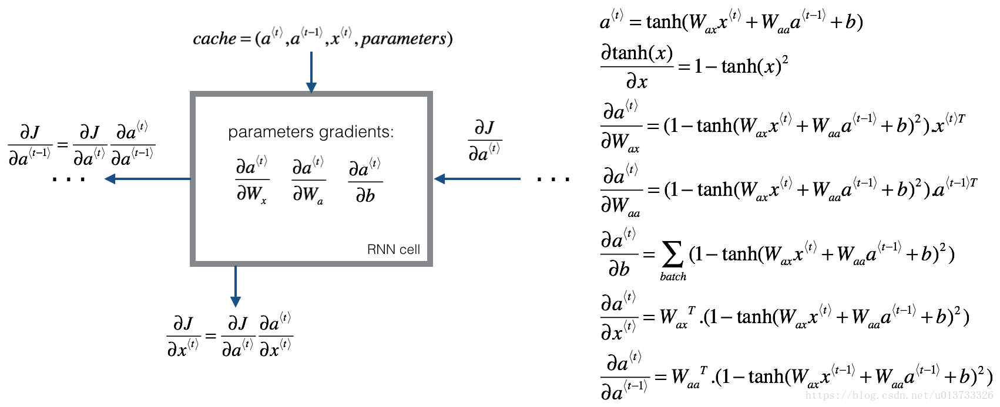
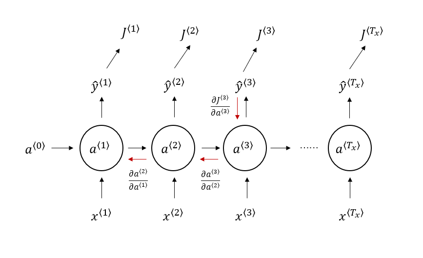

# RNN循环神经网络
RNN 是Recurrent Neural Network的简称，作为一种序列模型，用在了很多的地方，如语音识别，机器翻译，视频内容检测等等。由于循环神经网络具有记忆，能够按时序依次处理任意长度的信息，因此在自然语言处理上效果非常好。

[TOC]  
RNN模型  
前向传播
反向传播
LSTM 与 GRU  


## 一、RNN 模型
首先RNN最经典的网络结构图形如下所示：  
    
其中，$输入x的序列长度为 T_x，输出y的序列长度为 T_y ，经典RNN输出序列和输入序列长度是一样的，因此T_x=T_y$  
1）对于一个输入为$x$的句子序列，可以细分为一个一个的词，每一个词记为$x^{\langle t \rangle}$，有$x=\{x^{\langle 1 \rangle},x^{\langle 2 \rangle},x^{\langle 3 \rangle}...,x^{\langle t \rangle},...,x^{\langle T_x \rangle}\}$  
2）输出则为同样$y$的句子序列，可以细分为一个一个的词，每一个词记为$y^{\langle t \rangle}$，有$y=\{y^{\langle 1 \rangle},y^{\langle 2 \rangle},y^{\langle 3 \rangle}...,y^{\langle t \rangle},...,y^{\langle T_y \rangle}\}$   
3）除此之外，还包括一个隐状态$a^{\langle t \rangle}$，每次经过一个$RNN-CELL$预测单元，将会输出$a^{[t]}$。例如$a^{\langle t-1 \rangle}$经过一个事件步后输出$a^{\langle t \rangle}$，而$y^{\langle T_y \rangle}等于a^{\langle t \rangle}做一次激活操作获得的结果。$

### 1.1、RNN-CELL  
循环神经网络可以看做是RNN单元的重复，对于RNN-CELL有两种比较好的理解方式：  
1）通过MLP（前馈神经网络）拓扑结构转化：   
一般网络的MLP拓扑结构非常好理解，如下图为神经网络全连接结构：  
 
图（1-1） 普通MLP网络结构 

$其中输入x=\{x_1,x_2,x_3,...,x_n\}，输出为y=\{y_1,y_2,...,y_j\}，隐含层为a=\{a_1,a_2,...a_k\}。我们把MLP当做一个RNN-CELL单元，并且将向量x和向量y作为在t时刻的输入输出x^{\langle t \rangle}和y^{\langle t \rangle}。将拓扑结构翻转过来后，做多次拼接，如下图。这样就将RNN和前馈神经网络联系起来了$
  
图（1-2） 将MLP翻转拼接后得到的RNN结构  

2）如果以计算单元的方式去理解，可以得到如下所示的运算图形：   
  
图（1-3）: 基本的RNN单元  

运算图形实际上就是展示了RNN单元内部神经网络的实际运算逻辑，对于如上计算单元的实现，可以分为下面几步公式：  
- 通过上一步输入的隐含状态$a^{\langle t-1 \rangle}$计算当前单元的$a^{\langle t \rangle}$：  
$$a^{\langle t \rangle} = \tanh(W_{aa} a^{\langle t-1 \rangle} + W_{ax} x^{\langle t \rangle} + b_a) \tag{1.1}$$ 
- 通过当前隐含层$a^{[t]}$计算$\hat{y}^{\langle t \rangle}$
$$\hat{y}^{\langle t \rangle} = softmax(W_{ya} a^{\langle t \rangle} + b_y) \tag{1.2}$$  
上面就是$RNN$单元的一般前向传播公式，$W_{aa},W_{ax},W_{ya}$为对应所要训练的权值矩阵，$b_a,b_y$是偏置。  
- 假如当前刻输入为$x^{\langle t \rangle}$，他的向量长度为$(n_x)$，上一时间片输入的隐藏层激活值为$a^{\langle t-1 \rangle}$，设置输出长度为$(n_a)$。那么为了保证计算输出的激活值$a^{\langle t \rangle}$的长度不变，$W_{aa}$的维度必须为$(n_a,n_a)$，$W_{ax}$的维度为$(n_a,n_x)$。同理对于输出$\hat{y}^{\langle t \rangle}$，$W_{ya}$的维度为$(n_y, n_a)$。$b_a,b_y$作为偏置维度分别为$(n_a,1)，(n_y,1)$。  

在神经网络运算过程中，如果输入多个样本进行前向传播运算，可以使用for循环的方式。也可以使用矩阵运算的方式，这里一次性输入$m$样本做矩阵运算，则输入$x^{\langle t \rangle}$矩阵变为$(n_x,m)$，$a^{\langle t-1 \rangle}$的维度也变为$(n_x,m)，如下所示为单个RNN单元的前向转播实现：$  


```python
def rnn_cell_forward(xt, a_prev, parameters):
    """
    RNN单元的前向传播
    params：
        xt          当前时间步的输入，一次性计算m个样本，因此维度为(n_x,m)
        a_prev      前一时刻的隐藏状态维度为m个样本的数量（n_a, m）
        parameters  存储整个权重的字典，其中权重有：
                        Wax  维度为（n_a, n_x）与输入xt做矩阵乘法
                        Waa  维度为（n_a, n_a）与前一个隐藏状态a_prev做矩阵乘法
                        Wya  维度为（n_y, n_a）与当前隐藏状态a_next做矩阵乘法
                        ba   维度为（n_a, 1） 偏置
                        by   维度为（n_y, 1） 偏置

    return:
        a_next     当前输出的隐藏状态at，维度（n_a, m）
        yt_pred    当前计算的输出，维度（n_y， m）
        cache      用于反向传播需要的元组集合，(a_next, a_prev, xt, parameters)
    """
    # 从“parameters”获取参数
    Wax = parameters["Wax"]
    Waa = parameters["Waa"]
    Wya = parameters["Wya"]
    ba = parameters["ba"]
    by = parameters["by"]
    
    # 完成公式（1.1）的计算
    a_next = np.tanh(np.dot(Waa, a_prev) + np.dot(Wax, xt) + ba)
    
    # 完成公式（1.2）的计算
    yt_pred = rnn_utils.softmax(np.dot(Wya, a_next) + by)
    
    # 保存反向传播需要的值
    cache = (a_next, a_prev, xt, parameters)
    return a_next, yt_pred, cache
```

### 1.2 RNN前向传播计算（对多个单元进行连接）
对如上RNN-CELL进行重复拼接得到RNN模型   

  
图（1-3）: RNN单元重复拼接而成的基本模型，也可以理解成图（1-2）MLP翻转拼接的神经网络结构的计算图  

因此可以实现RNN前向转播，示例代码如下：
```python
def rnn_forward(x, a0, parameters):
    """
    拼接RNN单元实现RNN的整体前向传播
    
    params：
        x           将所有xt时间输入拼接到一个矩阵中，一次性计算m个样本，因此维度为(n_x,m,T_x)
        a0          时间步为1的单元输入的隐藏状态是不存在的，因此对其初始化，维度（n_a, m）
        parameters  存储整个权重的字典，其中权重有：
                        Wax  维度为（n_a, n_x）与输入xt做矩阵乘法
                        Waa  维度为（n_a, n_a）与前一个隐藏状态a_prev做矩阵乘法
                        Wya  维度为（n_y, n_a）与当前隐藏状态a_next做矩阵乘法
                        ba   维度为（n_a, 1） 偏置
                        by   维度为（n_y, 1） 偏置
    
    返回：
        a          所有时间步的隐藏状态，维度为(n_a, m, T_x) -> [a1,a2,a3,...,at]
        y_pred     所有时间步的预测，维度为(n_y, m, T_x) -> [y1,y2,y3,...,yt]
        caches     为反向传播的保存的元组
    """
    
    # 使用caches 去装载所有cache
    caches = []
    
    # 获取 x 与 Wya 的维度信息，用于构造a和y
    n_x, m, T_x = x.shape
    n_y, n_a = parameters["Wya"].shape
    
    # 直接采用0矩阵来初始化a与y
    a = np.zeros([n_a, m, T_x])
    y_pred = np.zeros([n_y, m, T_x])
    
    # 使用外部输入的初始激活值a0进行计算
    a_next = a0
    
    # 使用for循环遍历所有时间
    for t in range(T_x):
        # 取出当前时间x[:, :, t]，通过cell计算下一步的激活值a和预测值y，并保留cache
        # cache 是一个 (a_next, a_prev, xt, parameters) 保留所有信息的元祖
        a_next, yt_pred, cache = rnn_cell_forward(x[:, :, t], a_next, parameters)
        
        # 将t当前a值存起来
        a[:, :, t] = a_next
        
        # 将t当前y值存起来
        y_pred[:, :, t] = yt_pred
        
        # 把cache保存到caches列表中。
        caches.append(cache)
    
    # 全部完成后，把x输入矩阵也全部加入进来，实际上cache中已经存了每个时间步的x了
    caches = (caches, x)
    
    return a, y_pred, caches
```

### 1.3 RNN反向转播的计算
RNN反向传播跟一般的神经网络模型有一些区别，就是需要做递归操作，这里先看如下图，之后再慢慢解释：  

   
图（1-4）: RNN单元的反向传播

对于RNN，我们在序列的每个单元都存在损失函数，我们把损失函数定义为$J$。训练本质就是求$(W_{ax},W_{aa},b_a,W_{ya},b_y)$合适的值（注意在序列每个CELL中，这些值都是共用的，即RNN序列共用一套权重），采用梯度下降法求他们的梯度并更新这些值。  
RNN对于序列输入 $\{x^{\langle 1 \rangle}, x^{\langle 2 \rangle}, ..., x^{\langle T_x \rangle}\}$,  会有序列输出 $\{y^{\langle 1 \rangle}, y^{\langle 2 \rangle}, ..., x^{\langle T_y \rangle}\}$。最后的损失函数$J$是把各个时间点$y^{\langle t \rangle}$的单个 $J^{\langle t \rangle}$ 加起来。根据导数的性质（和的导数等于导数的和），可以化解成对每个$J^{\langle t \rangle}$求导，最后加起来。    

首先对于某一个单元可知：  
$$ J^{\langle t \rangle}=Loss(\hat{y}^{\langle t \rangle})   \tag{1.3}$$   

对于$(W_{ya},b_y)$求取梯度比较简单，说明下公式假定输入输出一样$T_x=T_y=τ$，根据（1.2）式我们可以先拆分得到如下两个式子，用$o^{\langle t \rangle}$ 做线程输出的赋值：  
$$\hat{y}^{\langle t \rangle} = softmax(o^{\langle t \rangle}) \tag{1.4}$$    
$$o^{\langle t \rangle} =W_{ya} a^{\langle t \rangle} + b_y \tag{1.5}$$     

根据公式（1.3）、（1.4）、（1.5）通过链式法则得到：  
$$\frac{\partial J}{\partial W_{ya}}=\quad \sum_{t=1}^{τ}\frac{\partial J^{\langle t \rangle}}{\partial W_{ya}}=\quad \sum_{t=1}^{τ}\frac{\partial J^{\langle t \rangle}}{\partial o^{\langle t \rangle}} \frac{\partial o^{\langle t \rangle}}{\partial W_{ya}} \tag{1.6}  $$   
$$\frac{\partial J}{\partial b_y}=\quad \sum_{t=1}^{τ}\frac{\partial J^{\langle t \rangle}}{\partial b_y}=\quad \sum_{t=1}^{τ}\frac{\partial J^{\langle t \rangle}}{\partial o^{\langle t \rangle}} \frac{\partial o^{\langle t \rangle}}{\partial b_y} \tag{1.7}  $$   

为什么要用 $\frac{\partial J}{\partial o}$ 而不用$\frac{\partial J}{\partial y}$ 呢？因为损失函数可以有很多形式，一般损失函数对于输出$o$求$\frac{\partial J}{\partial o}$都有相应的推导公式，这里举例如果使用的是交叉熵函数：  
$$J^{\langle t \rangle}=\quad -\sum_{i=1}^{n_y}y_i^{\langle t \rangle}\log \hat{y_i}^{\langle t \rangle} \tag{1.8}$$  
$其中y_i^t为真实值，\hat{y_i}^{\langle t \rangle}为预测值,i为t时间片输出的向量i位置值$。

这里不再推导交叉熵的倒数公式，有兴趣的可以查看相应文章去推导，通过交叉熵公式可以得到$J$对$o$的倒数如下： 
$$\frac{\partial J^{\langle t \rangle}}{\partial o^{\langle t \rangle}}=\hat{y}^{\langle t \rangle}- y^{\langle t \rangle} \tag{1.9}$$
那么（1.6）和（1.7）式分别变为：  
$$ \frac{\partial J}{\partial W_{ya}}=\quad \sum_{t=1}^{τ}(\hat{y}^{\langle t \rangle}- y^{\langle t \rangle})(a^{\langle t \rangle })^T \tag{1.10}$$  
$$ \frac{\partial J}{\partial b_y}=\quad \sum_{t=1}^{τ}(\hat{y}^{\langle t \rangle}- y^{\langle t \rangle}) \tag{1.11}$$  
注意$(a^{\langle t \rangle })^T中T是矩阵的转置，矩阵的求导法则这里不再赘述，乘函数AB对A求导 结果等于矩阵B的转置，公式如下$。
$$\frac{\partial AB}{\partial A} = B^T \tag{1.12}$$ 

而对于$(W_{ax},W_{aa},b_a)$稍微复杂一点，从RNN的模型可以看出，在反向传播时，在在某一序列位置$t$的梯度损失由当前位置的输出对应的梯度损失和序列索引位置$t+1$时的梯度损失两部分共同决定。对于$W指代(W_{ax},W_{aa})$在某一序列位置$t$的梯度损失需要反向传播一步步的计算。需要引入一个概念BPTT（back-propagation through time）的运算法则:  
  
图（1-5）: RNN反向传播BPTT

$W是我们要更新的权重，由于W_{ax}和W_{aa}很类似，为了展示BPTT所以统一用W表示：$  
$$\frac {\partial J}{\partial W} = \sum_{t=1}^{τ} \frac {\partial J^{\langle t \rangle}}{\partial W}=\sum_{t=1}^{τ}  \frac {\partial J^{\langle t \rangle}}{\partial a^{\langle t \rangle}}\frac {\partial a^{\langle t \rangle}}{\partial W} \tag{1.13}$$  
$其中 a_{t} 是关于W和a_{t−1}的函数，而a_{t−1}又是关于W和a_{t−2}的函数，$继续使用链式法则可以得到：  
$$\frac {\partial J}{\partial W} = \sum_{t=1}^τ \sum_{k=1}^t \frac {\partial J^{\langle t \rangle}}{\partial a^{\langle t \rangle}}\frac {\partial a^{\langle t \rangle}}{\partial a^{\langle k \rangle}} \frac {\partial a^{\langle k \rangle}}{\partial W}  \tag {1.14}$$  
而由于图（1-5）可以直观的看到：  
$$\frac {\partial a^{\langle t \rangle}}{\partial a^{\langle k \rangle}} = \prod_{i=k+1}^{t} \frac {\partial a^{\langle i \rangle}}{\partial a^{\langle i-1 \rangle}} \tag {1.15}$$  
因此（1.14）最终变为：  

$$\frac {\partial J}{\partial W} = \sum_{t=1}^τ \sum_{k=1}^t \frac {\partial J^{\langle t \rangle}}{\partial a^{\langle t \rangle}} (\prod_{i=k+1}^{t} \frac {\partial a^{\langle i \rangle}}{\partial a^{\langle i-1 \rangle}})  \frac {\partial a^{\langle k \rangle}}{\partial W}  \tag {1.16}$$  

由（1.14）式我们可以得到求$\frac {\partial J}{\partial W}$，转换成了求$\frac {\partial J^{\langle t \rangle}}{\partial a^{\langle t \rangle}}$，$\frac{\partial a^{\langle i \rangle}}{\partial a^{\langle i-1 \rangle}}$ 与$\frac {\partial a^{\langle k \rangle}}{\partial W}$的值，而对于$\frac {\partial J^{\langle t \rangle}}{\partial a^{\langle t \rangle}}$我们有如下式：    
$$\frac {\partial J^{\langle t \rangle}}{\partial a^{\langle t \rangle}}=\frac {\partial J^{\langle t \rangle}}{\partial a^{\langle t+1 \rangle}} \frac {\partial a^{\langle t+1 \rangle}}{\partial a^{\langle t \rangle}} + \frac{\partial J^{\langle t \rangle}}{\partial o^{\langle t \rangle}}\frac{\partial o^{\langle t \rangle}}{\partial a^{\langle t \rangle}}\tag{1.17}$$  
这里我们只假设RNN只有一层，这样$\frac {\partial J^{\langle t \rangle}}{\partial a^{\langle t \rangle}}$ 由其输出层和上一个时刻隐层共同决定，对于$\frac {\partial J^{\langle τ \rangle}}{\partial a^{\langle τ \rangle}}$ 后面没有其他序列索引了因此：  
 $$\frac {\partial J^{\langle τ \rangle}}{\partial a^{\langle τ \rangle}} = \frac{\partial o^{\langle τ \rangle}}{\partial a^{\langle τ \rangle}} \tag{1.18}$$

为了简化后反向传播难度计算，接下来我们编写计算单个$RNN-CELL$的 $\frac{ \partial a^{\langle t \rangle} } {\partial W_{ax}}, \frac{ \partial a^{\langle t \rangle} } {\partial W_{aa}},  \frac{ \partial a^{\langle t \rangle} } {\partial b}$的反向传播代码，首先$tanh(u)的导数如下$：  
$$ d\tanh(u) =(1-\tanh(u)^2) \tag {1.19}du$$  
由式（1.1）并且根据图（1-4）可以计算出：  
$$ \frac{ \partial a^{\langle t \rangle} } {\partial W_{ax}} = (1-tanh(W_{aa} a^{\langle t-1 \rangle} + W_{ax} x^{\langle t \rangle} + b_a)^2)x^{{\langle t \rangle}T} \tag {1.20}$$

$$ \frac{ \partial a^{\langle t \rangle} } {\partial W_{aa}} = (1-tanh(W_{aa} a^{\langle t-1 \rangle} + W_{ax} x^{\langle t \rangle} + b_a)^2)a^{{\langle t-1 \rangle}T} \tag {1.21}$$  

$$ \sum_{batch}\frac{ \partial a^{\langle t \rangle} } {\partial b_a} = (1-tanh(W_{aa} a^{\langle t-1 \rangle} + W_{ax} x^{\langle t \rangle} + b_a)^2) \tag {1.22}$$  

$$ \frac{ \partial a^{\langle t \rangle} } {\partial x^{\langle t \rangle}} = W_{ax}^T\cdot(1-tanh(W_{aa} a^{\langle t-1 \rangle} + W_{ax} x^{\langle t \rangle} + b_a)^2) \tag {1.23}$$  

$$ \frac{ \partial a^{\langle t \rangle} } {\partial a^{\langle t-1 \rangle}} = W_{aa}^T\cdot(1-tanh(W_{aa} a^{\langle t-1 \rangle} + W_{ax} x^{\langle t \rangle} + b_a)^2) \tag {1.24}$$  


```python
def rnn_cell_backward(da_next, cache):
    """
    实现基本的RNN单元的单步反向传播
    
    参数：
        da_next    关于下一个隐藏状态的损失的梯度。
        cache      字典类型，rnn_step_forward()记录的cache
        
    返回：
        gradients   字典，包含了以下参数：
                        dx        输入数据的梯度，维度为(n_x, m)
                        da_prev   上一隐藏层的隐藏状态，维度为(n_a, m)
                        dWax      输入到隐藏状态的权重的梯度，维度为(n_a, n_x)
                        dWaa      隐藏状态到隐藏状态的权重的梯度，维度为(n_a, n_a)
                        dba       偏置向量的梯度，维度为(n_a, 1)
    """
    # 获取cache 的值
    a_next, a_prev, xt, parameters = cache
    
    # 从 parameters 中获取参数
    Wax = parameters["Wax"] 
    Waa = parameters["Waa"]
    Wya = parameters["Wya"]
    ba = parameters["ba"]
    by = parameters["by"]
    
    # 计算tanh相对于a_next的梯度. （1.19）公式
    # a_next实际上就是 np.tanh(np.dot(Waa, a_prev) + np.dot(Wax, xt) + ba) 计算结果
    dtanh = (1 - np.square(a_next)) * da_next
    
    # 计算关于Wax损失的梯度 (1.20)
    dxt = np.dot(Wax.T,dtanh)
    dWax = np.dot(dtanh, xt.T)
    
    # 计算关于Waa损失的梯度 (1.21)
    da_prev = np.dot(Waa.T,dtanh)
    dWaa = np.dot(dtanh, a_prev.T)
    
    # 计算关于b损失的梯度 (1.22)
    dba = np.sum(dtanh, keepdims=True, axis=-1)
    
    # 保存这些梯度到字典内
    gradients = {"dxt": dxt, "da_prev": da_prev, "dWax": dWax, "dWaa": dWaa, "dba": dba}
    
    return gradients
```
单个cell的反向传播计算完毕，开始计算整体的反向传播
```python
def rnn_backward(da, caches):
    """
    在整个输入数据序列上实现RNN的反向传播
    
    参数：
        da        所有隐藏状态的梯度，维度为(n_a, m, T_x)
        caches    包含向前传播的信息的元组
    
    返回：    
        gradients   包含了梯度的字典：
                        dx     关于输入数据的梯度，维度为(n_x, m, T_x)
                        da0    关于初始化隐藏状态的梯度，维度为(n_a, m)
                        dWax   关于输入权重的梯度，维度为(n_a, n_x)
                        dWaa   关于隐藏状态的权值的梯度，维度为(n_a, n_a)
                        dba    关于偏置的梯度，维度为(n_a, 1)
    """
    # 从caches中获取第一个cache（t=1）的值
    caches, x = caches
    a1, a0, x1, parameters = caches[0]
    
    # 获取da与x1的维度信息
    n_a, m, T_x = da.shape
    n_x, m = x1.shape
    
    # 初始化梯度
    dx = np.zeros([n_x, m, T_x])
    dWax = np.zeros([n_a, n_x])
    dWaa = np.zeros([n_a, n_a])
    dba = np.zeros([n_a, 1])
    da0 = np.zeros([n_a, m])
    da_prevt = np.zeros([n_a, m])
    
    # 处理所有时间步
    for t in reversed(range(T_x)):
        # 计算时间步“t”时的梯度
        gradients = rnn_cell_backward(da[:, :, t] + da_prevt, caches[t])
        
        #从梯度中获取导数
        dxt, da_prevt, dWaxt, dWaat, dbat = gradients["dxt"], gradients["da_prev"], gradients["dWax"], gradients["dWaa"], gradients["dba"]
        
        # 通过在时间步t添加它们的导数来增加关于全局导数的参数
        dx[:, :, t] = dxt
        dWax += dWaxt
        dWaa += dWaat
        dba += dbat
        
    #将 da0设置为a的梯度，该梯度已通过所有时间步骤进行反向传播
    da0 = da_prevt
    
    #保存这些梯度到字典内
    gradients = {"dx": dx, "da0": da0, "dWax": dWax, "dWaa": dWaa,"dba": dba}
    
    return gradients
```
  


## 二、LSTM 长短记忆模型  
传统的RNN反向传播拥有如下特点：
- Tanh 输出在-1和1之间
- 梯度消失
- 较远的步骤梯度贡献很小
- 切换其他激活函数后，可能也会导致梯度爆炸  

为什么RNN会梯度消失和梯度爆炸？
从式（1.1）和（1.16）中可得一项式子：  
$$\prod_{i=k+1}^{t} \frac {\partial a^{\langle i \rangle}}{\partial a^{\langle i-1 \rangle}}=\prod_{i=k+1}^{t} \tanh'W_{aa}$$   
- 对于tanh激活函数求导将会落在[0,1]区间内，随着时间的积累，整个梯度将会趋近于0。同理如果$W_{aa}$很大时，可能导致$tanh'W_{aa}$会不断变大，此时也有可能出现梯度爆炸。


为什么需要LSTM：  
- 普通的RNN的信息不能长久传播（存在于理论上）
- 引入选择性机制（选择性输出、选择性输入、选择性遗忘）
- 选择性用门阀控制，使用Sigmoid函数[0,1]
- LSTM可以抑制梯度消失（梯度爆炸比较简单，可以通过裁剪抑制）

由于LSTM模型比普通RNN复杂，接下来我不会再用numpy去做基础实现，换一种Tensorflow进行代码实现，比较简洁。有兴趣研究实现细节的可以查看吴恩达deeplearning.ai的课后作业，这里放上所有实现所搬运的GIT地址。  


